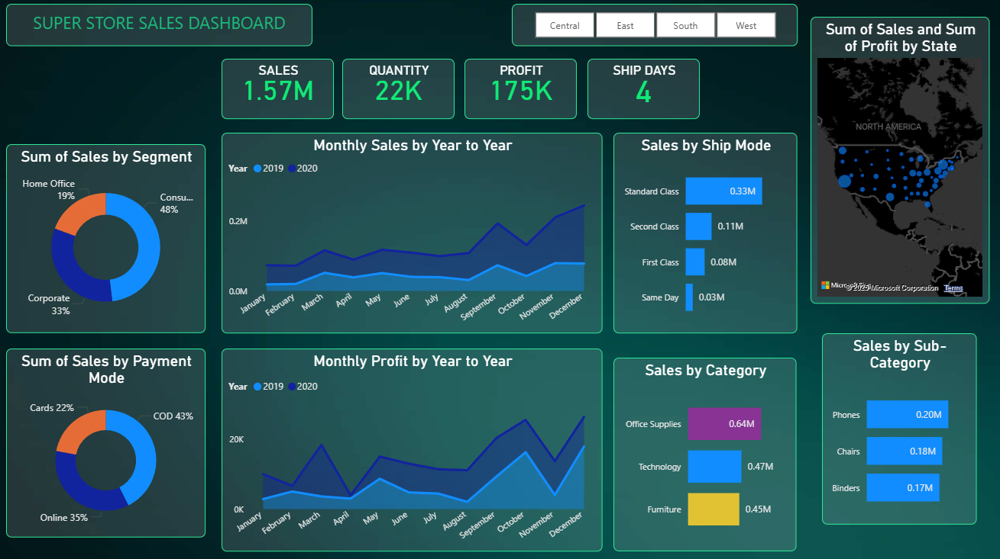

# Super Store Sales Dashboard

## Overview
Interactive Power BI dashboard designed to analyze sales performance, customer trends, regional insights, and future sales forecasting for business decision-making.

## Tools Used
- Power BI
- Excel

## Features
- Sales & Profit KPIs
- Region-wise Sales Analysis
- Location-based Visualization
- Future Sales Forecasting
- Category & Sub-category Analysis
- Monthly Profit & Sales Trends
- Interactive Filters & Slicers

## Dashboard Preview

## Key Insights
- Identified top-performing regions and categories
- Analyzed monthly sales and profit growth trends
- Visualized location-based sales performance using maps
- Implemented forecasting techniques to predict future sales trends

## Project Files
superstore-dashboard.pbix

## Author
Ubaid Sindhi
